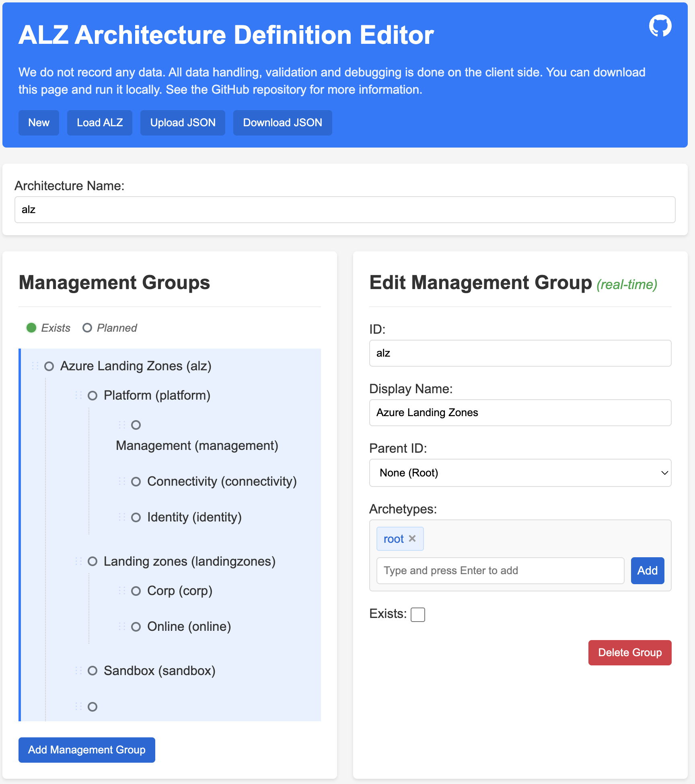

# ALZ Architecture Editor

This **experimental** project is a web-based architecture editor for the ALZ (Azure Landing Zones) architecture definitions.

You can use it to create and edit Azure Landing Zones architecture diagrams, and export them as JSON files that can be used with the Azure Landing Zones Terraform provider.



## How to use

1. Clone the repository:

    ```bash
    git clone https://github.com/matt-FFFFFF/alzarchitectureedit.git
    ```

2. Open the `index.html` file in your web browser.
